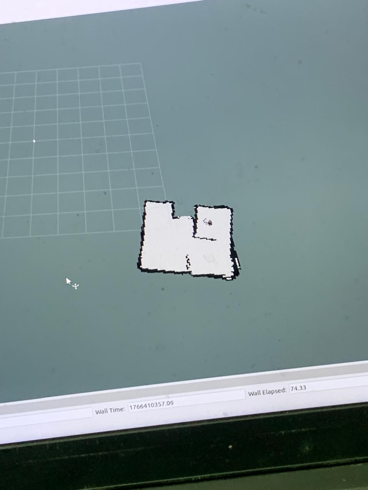
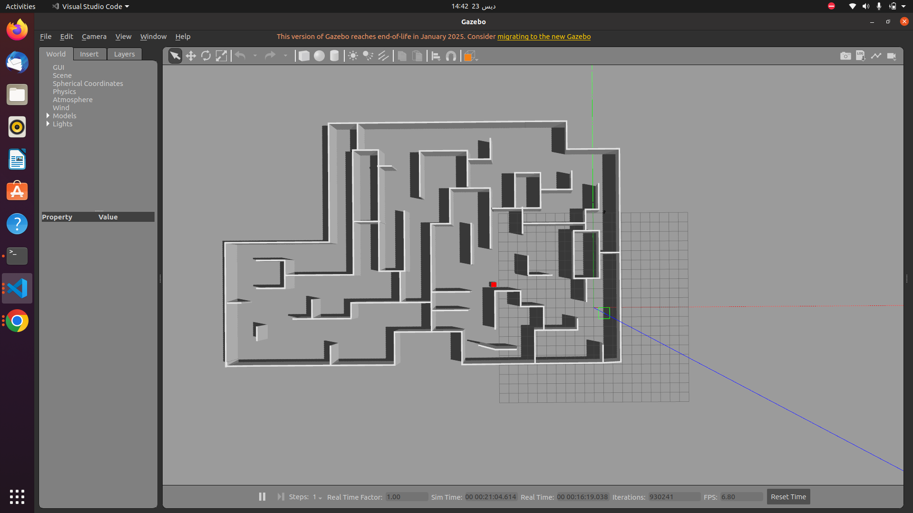
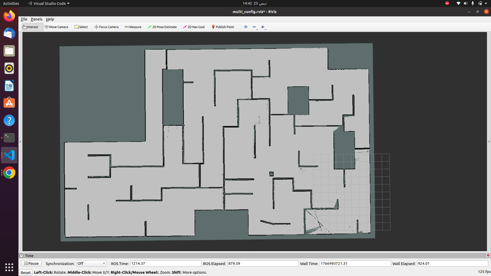

# Single Robot Navigation - Hardware Testing

## 1. Overview

Autonomous navigation system for LIMO robot using ROS Noetic. The robot explores environments, builds maps using SLAM, and detects targets.

**Hardware:** LIMO robot with 2D LiDAR and RGB camera

## 2. Mapping

Uses **SLAM Toolbox** for real-time mapping during autonomous exploration. **Explore Lite** identifies unexplored areas and navigates to them automatically.

- LiDAR scans environment continuously
- SLAM builds 2D occupancy grid map
- Loop closure corrects drift
- Hardware testing generated accurate real-world maps

## 3. Localization

**SLAM-based localization** tracks robot position while building the map.

- Scan matching matches LiDAR data to map
- Position updates at >10Hz
- Pose graph optimization reduces errors
- Position accuracy < 0.1m

## 4. Hardware Testing & Results

- ✅ Autonomous exploration and mapping
- ✅ Accurate localization 
- ✅ Complete environment coverage

<video controls src="Video Project.mp4" title="Navigation Video"></video>

## 5. Multi-Robot Simulation

- Simulation-only setup with three LIMO robots exploring the same world
- Launch: `roslaunch robotics_project_pkg limo_three_robot.launch`
- Each robot runs its own SLAM and exploration; maps merged by `map_merger.py` into `/map_merged`
- Use RViz config `rviz/multi_config.rviz` to monitor all robots and merged map
- Map merge: resolution from first map, frame `world`, overlapping cells favor obstacles

## 6. Target Detection

Vision node (`target_detector.py`) detects red boxes using HSV color thresholds. Publishes `/target_detected`, `/detection_status`, and `/debug_image`.

 
